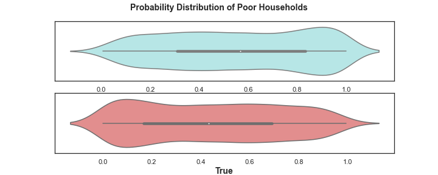

# Pover-T Tests: Predicting Poverty
Hosted by the World Bank
Driven Data

**Take Home Exercise Clarity AI**  

Based on the dataset provided, this project aims at **predicting whether or not a given household is poor or not**.  

Thus, the project takes a four-step approach:
<ul>
    <li>business understanding,</li>
    <li>data preprocessing,</li>
    <li>model building and</li>
    <li>productivization plan</li>
</ul>

## Main results
With a log-loss score of 0.4888, the best model (CatBoost) predicts a greater number of poor households with low degrees of probability and viceversa. The contrary holds true for non-poor households.
 

## Practical issues
### Installation
A conda environment has been created in order to isolate installed dependencies and control for possible interactions with base environment. A file `environment.yml` has also been included in the dossier for replication purposes. 

### Folder's structure
#### data
A train and test dataset were provided for the exercise. 

#### images
Pics for notebooks's visualization and storytelling. An image with result's violinplot (above) is also located here. 

#### model
This folder contains:
<ol>
    <li>the .csv output file with households'probability of being poor</li>
    <li>pickle file with CatBoost's best trained estimator, ready for production use</li>
</ol>

#### notebooks
Two notebooks here: one with the complete exercise's solutions and another one for <i>out-of-pipe</i> variables (numerical/categorical) encoding.
